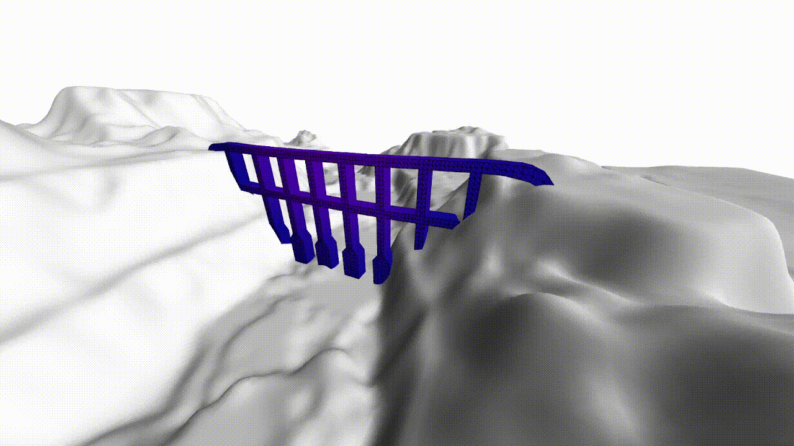
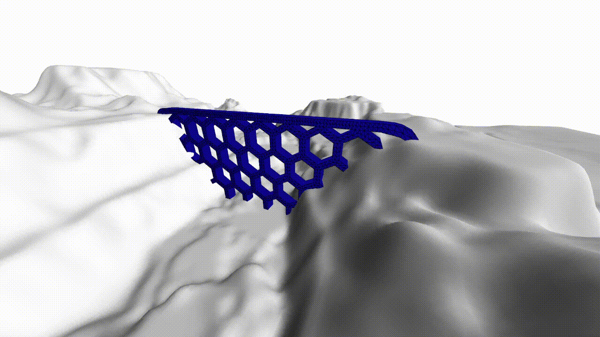

# BFM

Big F'ing Matrix.
FEM/FEA C library (`libbfm`) with Python bindings (`pybfm`) for use as an educational tool.

Originally our [final assignment for LEPL1110](https://github.com/allEyezOnCode/Projet-EF).

## Results

|Naive bridge desgin|"Beehive" bridge design|
|-|-|
|||

## Building

This repo is composed of two components; the backend `libbfm`, which implements all the routines BFM defines, and the frontend `pybfm`, which includes a thin Python wrapper above `libbfm` and visualisation facilities.

### libbfm

This uses CMake:

```console
mkdir -p libbfm/build
cd libbfm/build
cmake ..
```

To install the library and its headers, run this (as a superuser):

```console
make install
```

### pybfm

First, the FFI bindings to `libbfm` must be generated:

```console
python pybfm/bfm/gen_libbfm.py
```

Then, you may install the `bfm` Python module itself:

```console
pip install --user ./pybfm
```

Ubuntu 22.04, set the `DEB_PYTHON_INSTALL_LAYOUT` environment variable to `deb_system` when running the above command:

```console
DEB_PYTHON_INSTALL_LAYOUT=deb_system pip install --user ./pybfm
```

(See [this issue](https://github.com/pypa/setuptools/issues/3269).)

## Running

Assuming everything is built, you can run a simple example as such:

```console
python3 examples/deformation.py
```

That's it ;)

To execute a specific LEPL1110 problem:

```console
python3 lepl1110.py path/to/mesh path/to/problem
```

This will output `U.txt` and `V.txt` in the `data` directory.
